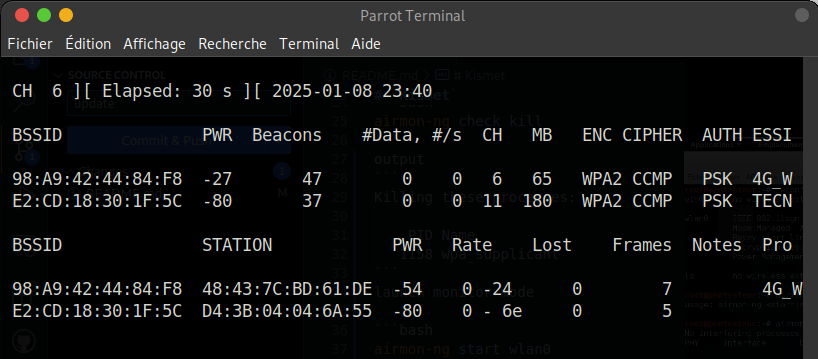
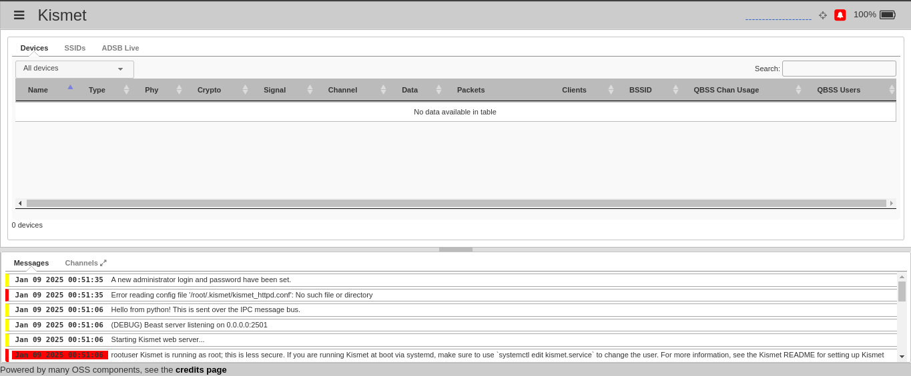

## acknowledgement
# `Aircrack-ng`
Aircrack-ng: is a suite of wireless network monitoring software whose primary use is to "crack" WEP and WPA keys of WIFI networks.

### some features
* `aircrack-ng:`static WEP and WAP-PSK key breaker (new breaker type: PTW);
* `airdecap-ng:` decryptor of captured WEP/WAP files;
* `airdriver-ng:`allows to patch drivers, for example for the case of rtl8187, which is useful for doing packet injection;
* `aireplay-ng:`packet injection program;
* `airmon-ng:`allows you to enable/disable the monitor mode of a wifi card. In this mode the wifi card acts as an "observer" of the network;
* `airodump-ng:` 802.11 packet capture program;

# `Kismet`
Kismet is a free software network detection, sniffer, and intrusion detection system for 802.11 wireless networks.

`Kismet` works with network cards that support monitor mode, and any 802.11 protocol (802.11a, 802.11b, 802.11g, and 802.11n).

It runs on Linux, FreeBSD, NetBSD, OpenBSD, and Mac OSX.

<hr>

* airmong-ng, airodump-ng

user:root
1. check kill
```bash
airmon-ng check kill
```
output
```output
Killing these processes:

    PID Name
   1158 wpa_supplicant
```
2. launch monitor mode
```bash
airmon-ng start wlan0
```
output
```
PHY	Interface	Driver		Chipset

phy0	wlan0		iwlwifi		Intel Corporation Wireless 7260 (rev 6b)
		(mac80211 monitor mode vif enabled for [phy0]wlan0 on [phy0]wlan0mon)
		(mac80211 station mode vif disabled for [phy0]wlan0)
```
3. start capture
```bash
airodump-ng wlan0mon
```


* Kismet 
```bash
kismet
```


KISMET - Point your browser to http://localhost:2501 
